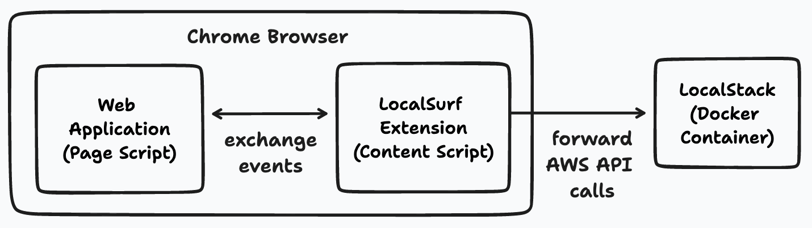

# 🏄 LocalSurf - Browse AWS Web Applications Locally

LocalSurf - a Chrome browser plugin to repoint AWS service calls to [LocalStack](https://localstack.cloud).

⚠️ Please note that this plugin is experimental and still under active development.

## Background

When developing and testing AWS cloud Web applications locally with LocalStack, we need to make the browser connect to the local endpoint (`http://localhost:4566`) instead of the AWS production servers (`*.amazonaws.com`).

This can be achieved by explicitly setting the [`endpoint` attribute](https://docs.aws.amazon.com/sdk-for-javascript/v2/developer-guide/specifying-endpoints.html) in the [AWS JavaScript SDK](https://docs.aws.amazon.com/AWSJavaScriptSDK/latest/AWS/Endpoint.html). Alternatively, it would be great if we could simply use the production code without changes, and have the browser make requests to LocalStack instead of AWS directly. This is where LocalSurf comes into play!

## Installation

This extension is not yet available in the Chrome Web Store, but can be installed directly from source. Head over to `chrome://extensions/` in Chrome, then select `"Load unpacked"` and point to the directory where the source code files (this repo) are stored on disk.

Once installed, a new icon should appear in the Chrome extensions bar. When clicking on the icon, the plugin can be enabled/disabled by toggling the "Enable local mode" checkbox (see below).


## Sample Demo

To illustrate how the plugin works, we use the AWS [Serverlesspresso](https://github.com/aws-samples/serverless-coffee-workshop) sample app. This app consists of various backend components (e.g., DynamoDB tables, Lambda functions, Cognito user pools, etc), as well as a hosted Web app user interface (UI) that can be used to interact with the backend components.

We can deploy the backend components to LocalStack directly, using the `samlocal` command line interface (CLI):
```
$ samlocal build
$ samlocal deploy
```

Once deployed, the `samlocal` CLI will print out a display app URL which will look similar to the following:
```
Key                 DisplayAppURI
Description         The URL for the Display App
Value               https://workshop-display.serverlesscoffee.com/?region=us-east-1&userPoolId=us-east-1_43c9800e64c84467aa0abdb102e226ef&userPoolWebClientId=vr9aw2jr7iv36ezwaaqlzzkvbp&poolId=us-east-1:95dc88d0-1029-48fe-ba7b-1e6a9741bfc5&host=localhost.localstack.cloud&orderManagerEndpoint=https://fapencq0ue.execute-api.amazonaws.com:4566/Prod&APIGWEndpointValidatorService=https://psmdc7b1lv.execute-api.amazonaws.com:4566/Prod&APIGWEndpointConfigService=https://hw7yw61ba7.execute-api.amazonaws.com:4566/Prod
```

We can then open the URL in the browser and confirm the configurations in the form dialog (see below).


Once confirmed, we are being forwarded to a signin screen, which uses an AWS Cognito user pool to manage authentication:


After clicking "Sign In" in this form, we can see that the browser makes a request to LocalStack (to `localhost.localstack.cloud`, which is a domain name that resolves to `127.0.0.1`).


This sample demonstrates how we can take an existing Web application, without any modification, and make it talk to the LocalStack APIs directly from the browser via the LocalSurf plugin.

## How it works

The plugin makes use of Chrome Extension [Content Scripts](https://developer.chrome.com/docs/extensions/mv3/content_scripts/), which run in the background in the browser - alongside the page scripts of the Web application itself. Whenever a Web application attempts to make a call to an AWS service (on `*.amazonaws.com` domains), then the call is intercepted and the page script forwards the request to the content script, which then performs the call against the LocalStack instance running in a Docker container on `localhost`.



LocalSurf supports both, requests made via the `XMLHttpRequest` and via the `fetch(..)` browser APIs.

## Disclaimer

Use this extension at your own risk - it is provided on an as-is basis, **without** warranties or conditions of **any** kind. In particular, it is your obligation to ensure that the use of this extension is compliant with the user license agreement and the terms & conditions of Amazon Web Services (AWS) and their services.

## License

This code is released under the Apache License Version 2.0 (see `LICENSE`).
